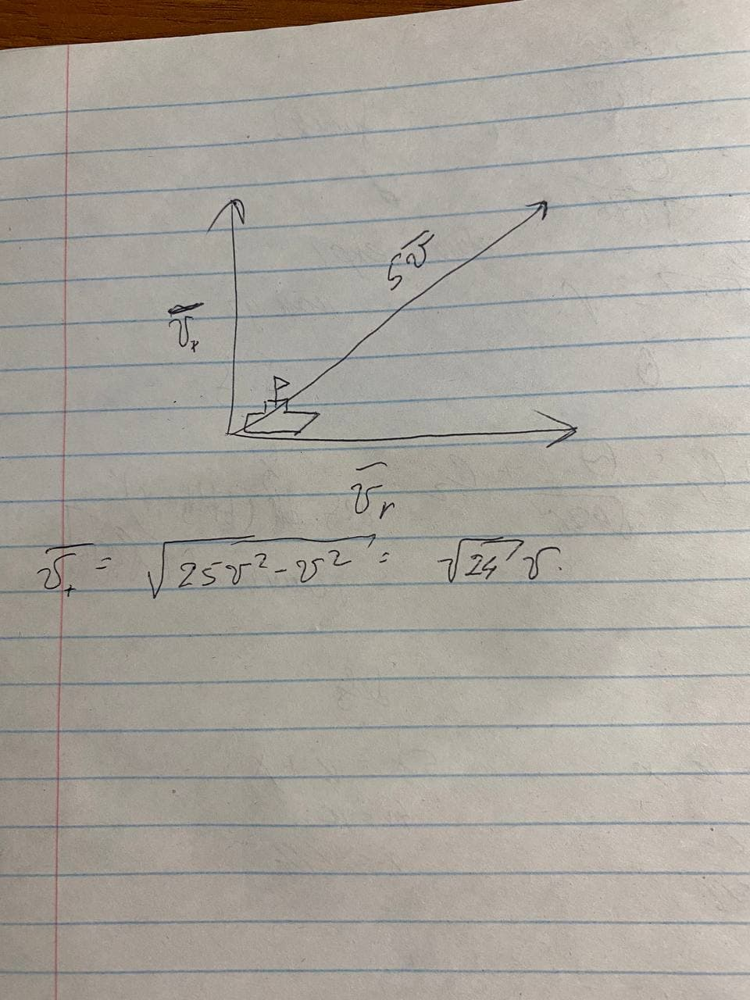
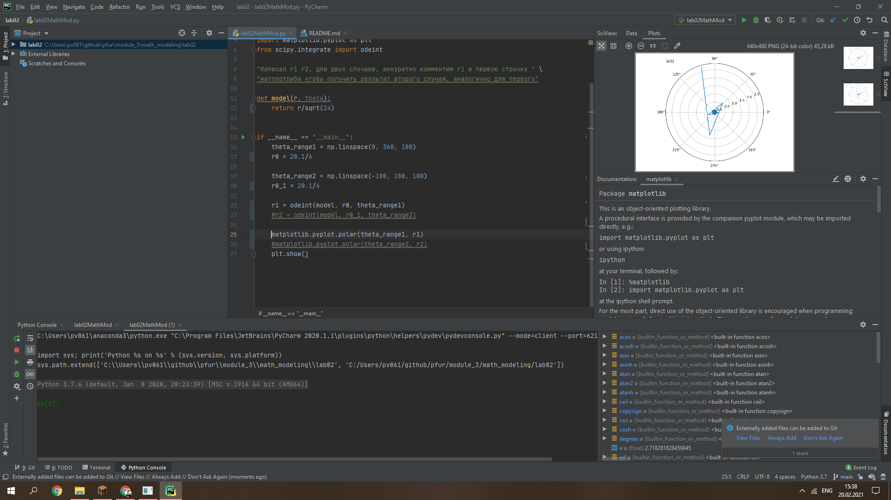

---
# Front matter
lang: ru-RU
title: "Лабораторная работа по математическому моделированию номер 2 "
author: "Подмогильный Иван Александрович"

# Formatting
toc-title: "Содержание"
toc: true # Table of contents
toc_depth: 2
lof: true # List of figures
lot: true # List of tables
fontsize: 12pt
linestretch: 1.5
papersize: a4paper
documentclass: scrreprt
polyglossia-lang: russian
polyglossia-otherlangs: english
mainfont: PT Serif
romanfont: PT Serif
sansfont: PT Sans
monofont: PT Mono
mainfontoptions: Ligatures=TeX
romanfontoptions: Ligatures=TeX
sansfontoptions: Ligatures=TeX,Scale=MatchLowercase
monofontoptions: Scale=MatchLowercase
indent: true
pdf-engine: lualatex
header-includes:
  - \linepenalty=10 # the penalty added to the badness of each line within a paragraph (no associated penalty node) Increasing the value makes tex try to have fewer lines in the paragraph.
  - \interlinepenalty=0 # value of the penalty (node) added after each line of a paragraph.
  - \hyphenpenalty=50 # the penalty for line breaking at an automatically inserted hyphen
  - \exhyphenpenalty=50 # the penalty for line breaking at an explicit hyphen
  - \binoppenalty=700 # the penalty for breaking a line at a binary operator
  - \relpenalty=500 # the penalty for breaking a line at a relation
  - \clubpenalty=150 # extra penalty for breaking after first line of a paragraph
  - \widowpenalty=150 # extra penalty for breaking before last line of a paragraph
  - \displaywidowpenalty=50 # extra penalty for breaking before last line before a display math
  - \brokenpenalty=100 # extra penalty for page breaking after a hyphenated line
  - \predisplaypenalty=10000 # penalty for breaking before a display
  - \postdisplaypenalty=0 # penalty for breaking after a display
  - \floatingpenalty = 20000 # penalty for splitting an insertion (can only be split footnote in standard LaTeX)
  - \raggedbottom # or \flushbottom
  - \usepackage{float} # keep figures where there are in the text
  - \floatplacement{figure}{H} # keep figures where there are in the text
---

# Цель работы

Ознакомиться с задачей о погоне и решить одну из них.

# Задание

Было необходимо:
* Записать уравнение, описывающее движение катера, с начальными условиями двух случаев (в зависимости от расположения катера
относительно лодки в начальный момент времени).
* Построить траекторию движения катера и лодки для двух случаев.
* Найти точку пересечения траектории катера и лодки.

# Выполнение лабораторной работы
1. В момент обнаружения Xл = 0, Xк = 7.1 км.
2. Ввел полярные координаты, считая что полюс это точка обнаружения лодки браконьеров Xл0 (theta = Xл0 = 0), а полярная ось r проходит через точку нахождения катера береговой охраны.
3. И катер и лодка должны быть на одном расстоянии от полюса theta, так их траектории пересекутся. Поэтому сначала
катер двигается прямолинейно, пока не окажется на том же расстоянии от полюса, что и лодка браконьеров.
После этого катер должен двигаться вокруг полюса удаляясь от него с той же скоростью, что и лодко браконьеров. 
4.Чтобы найти расстояние X первого этапа движения, составим уравнения: x/v = (k-x)/2.4/v и x/v = (x+k)/2.4/v
Отсюда найдем два значения: X1 = k/3.4 и X2 = k/1.4 (рис 1)

{ #fig:001 width=70% }

5. После того как катер прошел прямолинейно, он должен начать двигаться удаляясь от полюса. Для этого раскладываем 
скорость катера на две составляющие vr - радиальная скорость. И vt - тангенциальная скорость. Радиальная скорость
- это скорость, с которой катер удаляется от полюса, vr = dr/dt. Нужно, чтобы эта скорость была равна скорости лодки,
поэтому приравняем её к v: dr/dt = v. 
Тангенциальная скорость - это линейная скорость вращения катера относительно полюса. Она равна произведению угловой
скорости Dtheta/Dt на радиус r. Vt = r*Dtheta/dt.
vt = sqrt(5.76v^2 - v^2) = sqrt(4.76)*v. 
r*dtheta/dt = sqrt(4.76)*v
6. Система уравнений:
dr/dt = v
r*dtheta/dt = sqrt(4.76)*v
С начальными условиями:
theta0 = 0
r0 = 7.1/3.4

theta1 = -pi
r0 = 7.1/1.4

Далее исключаем dt из системы, и получаем уравнение dr/dtheta = r/sqrt(4.76)
Далее решаем уравнение и находим решение для для двух случаев.

Написал код, и запустил для первого случая. На рисунке показано движение лодки в полярных 
координатах при первом случае(рис 2)

{ #fig:001 width=70% }

Запустил для второго случая. На рисунке показано движение лодки в полярных координатах
при втором случае(рис 3)

{ #fig:001 width=70% }

# Выводы
Узнал, как можно решить задачу о погоне, и решил одну из них. 